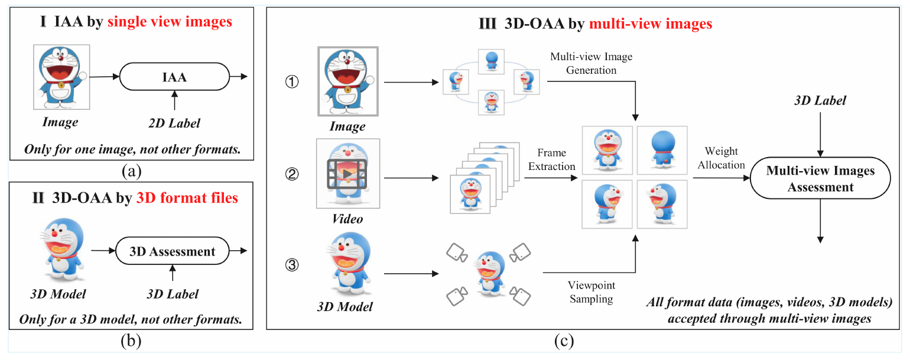
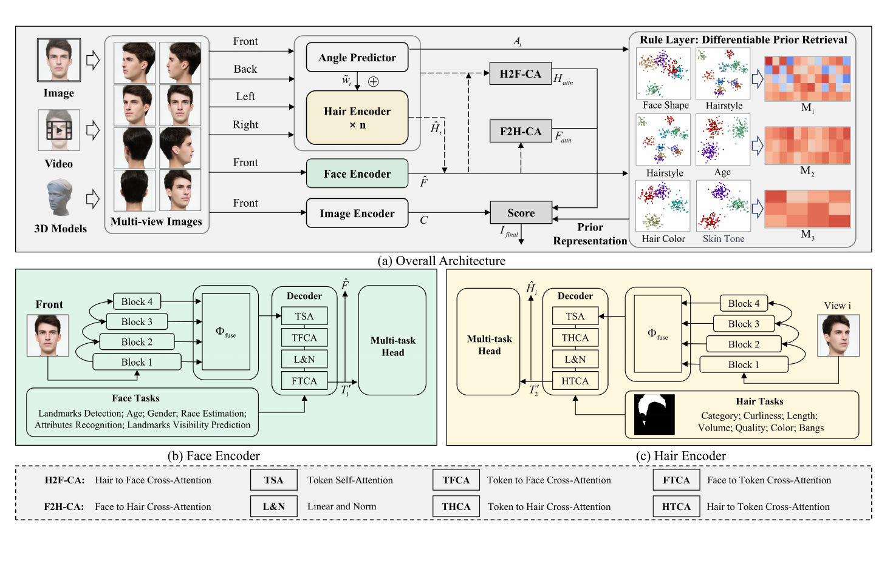
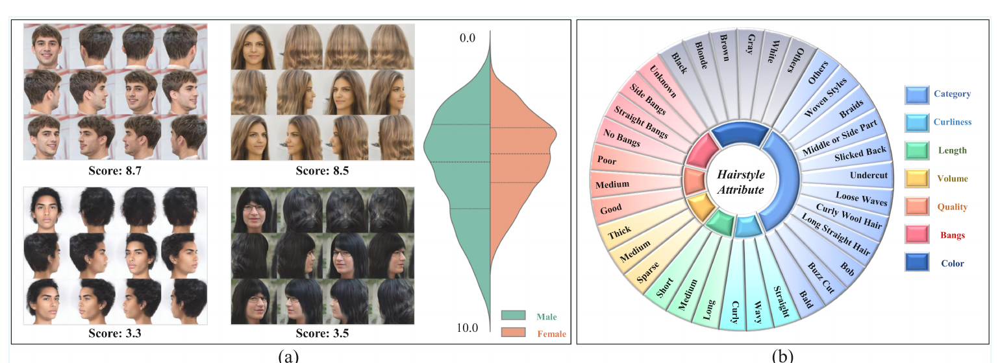

<div align="center">

# HAANet

### Thinking 3D Object Aesthetics Assessment: Employing Hairstyle Aesthetics Assessment as An Exemplification

**Shuai He · Hongkun Ruan · Anlong Ming<sup>*</sup> · Zhaowen Lin · Haiyang Zhang**

Beijing University of Posts and Telecommunications

[](https://doi.org/10.1145/3767308.3836093)
[](https://www.python.org/)
[](https://pytorch.org/)

**English** · [[简体中文](README_ZH.md)]

</div>

HAANet is a multi-view aesthetic assessment network for Hairstyle Aesthetics Assessment (HAA) and an instantiation of the proposed 3D Object Aesthetics Assessment (3D-OAA) paradigm. This repository provides code for stage-two training, single-sample inference, and evaluation on HAA10K.

<p align="center">
  
</p>
<p align="center"><em>3D-OAA converts images, videos, or 3D models into multi-view images for aesthetic assessment.</em></p>

## Method

The released implementation takes four views of the same subject: front, back, left, and right.

<p align="center">
  
</p>
<p align="center"><em>Architecture of HAANet.</em></p>

- **Hair Encoder:** Swin-B multi-scale features with a bidirectional Transformer decoder.
- **Face Encoder:** Swin-B multi-scale features with a face-task Transformer decoder.
- **Multi-view Fusion:** combines angle-classification features with four learnable view weights.
- **Cross Attention:** bidirectional Face-to-Hair and Hair-to-Face cross-attention.
- **Image Encoder:** ConvNeXt-Base for global image features.
- **Rule Layer:** produces prior scores from semantic prototypes and three compatibility matrices.
- **Score Head:** fuses local, global, and prior features to predict an aesthetic score from 0 to 10.

## Installation

```bash
conda create -n haanet python=3.10 -y
conda activate haanet
pip install -r requirements.txt
```

On the first run, torchvision downloads the ImageNet-1K V1 weights for Swin-B and ConvNeXt-Base.

## Dataset and Weights

Download the HAA10K images and model weights:

- [Google Drive](https://drive.google.com/drive/folders/1bOKiGFV5QdHfJlhikVhtvoXljOT_N37u?usp=sharing)
- [Baidu Drive](https://pan.baidu.com/s/1W4C91ePORydaB7hTpiENRw?pwd=ace6)

<p align="center">
  
</p>
<p align="center"><em>Multi-view HAA10K samples, score distribution, and hairstyle attributes.</em></p>

Organize the downloaded files as follows:

```text
HAANet/
├── HAA10K/
│   └── score.json
├── dataset/
│   └── images/
│       ├── 0_0.png
│       ├── 0_1.png
│       └── ...                # 12 views per sample, indexed from 0 to 11
├── model/
│   ├── hair.pt                # pretrained Hair Encoder
│   ├── face.pt                # pretrained Face Encoder
│   └── best_aesthetic_model3.pth
└── src/
```

View indices are front `0`, back `6`, left `1-5`, and right `7-11`. During training, one left view and one right view are sampled from their respective candidate sets.

## Inference

Run inference using the HAA10K naming convention:

```bash
python src/infer_cli.py \
  --sample-dir dataset/images \
  --sample-id 0
```

Alternatively, provide four image paths:

```bash
python src/infer_cli.py \
  --front front.png \
  --back back.png \
  --left left.png \
  --right right.png
```

The output contains the aesthetic score, predicted angle class for each view, and the resolved input paths. Use `--hair-weights`, `--face-weights`, `--model-weights`, and `--device` to override the default weights or device.

## Evaluation

```bash
python src/evaluate_cli.py \
  --data-root dataset/images \
  --labels HAA10K/score.json \
  --seed 42 \
  --augment-multiplier 5 \
  --batch-size 16
```

Results are written to `evaluation_results/`, including LCC, SRCC, MSE, MAE, RMSE, five-level accuracy, and per-sample predictions. For a quick pipeline check:

```bash
python src/evaluate_cli.py \
  --data-root dataset/images \
  --max-samples 32 \
  --augment-multiplier 1
```

## Training

The released code runs stage-two training: it loads `hair.pt` and `face.pt` and jointly optimizes the complete HAANet model.

```bash
python src/train_cli.py \
  --data-root dataset/images \
  --labels HAA10K/score.json \
  --hair-weights model/hair.pt \
  --face-weights model/face.pt \
  --epochs 3 \
  --batch-size 8 \
  --learning-rate 1e-5 \
  --augment-multiplier 5 \
  --save-path checkpoints/best_model.pth \
  --last-epoch-path checkpoints/last_epoch.pth \
  --log-dir runs
```

Training objective:

```text
L = L1(score) + 0.5 * CrossEntropy(angle) + 0.1 * L1(rule matrices)
```

Validation MAE is used for learning-rate scheduling and best-checkpoint selection. Rule Layer prototypes are re-clustered from training features at epochs 0, 10, 20, and so on. Do not point `--save-path` to the released best checkpoint.

### Training smoke test

The following command uses a small subset and writes checkpoints to a separate directory:

```bash
python src/train_cli.py \
  --data-root dataset/images \
  --epochs 1 \
  --batch-size 2 \
  --augment-multiplier 1 \
  --max-train-samples 12 \
  --max-val-samples 4 \
  --save-path checkpoints/smoke/best.pth \
  --last-epoch-path checkpoints/smoke/last.pth \
  --log-dir runs/smoke
```

To check model loading, forward propagation, and backward propagation only:

```bash
python src/smoke_test.py --train-step
```

## Project Structure

```text
src/
├── model3_enhanced.py     # HAANet model
├── FaceEncoder.py         # Face Encoder
├── HairEncoder.py         # Hair Encoder
├── transformer.py         # bidirectional Transformer
├── dataset.py             # HAA10K data loading
├── infer_cli.py           # single-sample inference
├── evaluate_cli.py        # dataset evaluation
├── train_cli.py           # stage-two training entry point
├── training.py            # training and validation loops
└── smoke_test.py          # environment and model checks
```

## Citation

```bibtex
@inproceedings{he2026thinking,
  title     = {Thinking 3D Object Aesthetics Assessment: Employing Hairstyle Aesthetics Assessment as An Exemplification},
  author    = {He, Shuai and Ruan, Hongkun and Ming, Anlong and Lin, Zhaowen and Zhang, Haiyang},
  booktitle = {Proceedings of the 35th ACM International Conference on Multimedia},
  year      = {2026},
  doi       = {10.1145/3767308.3836093}
}
```

<sup>*</sup> Corresponding author.
